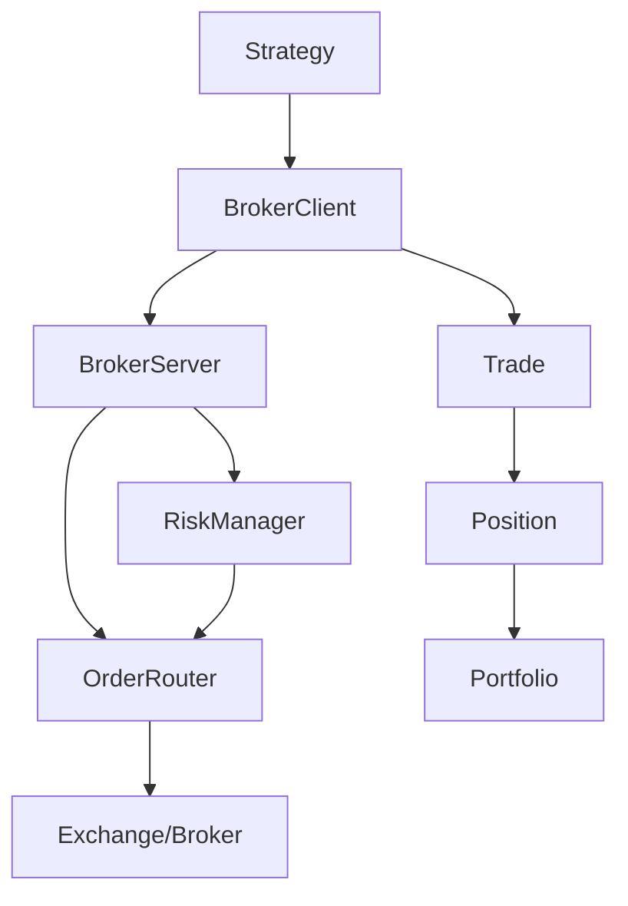

# Brokers 模块

QKA系统的交易接口模块，提供与不同券商和交易平台的接口封装。

## 模块列表

### [client.py](client.md)
交易客户端接口，提供统一的交易API封装。

**主要类：**
- `BrokerClient` - 基础交易客户端
- `SimulatedClient` - 模拟交易客户端
- `LiveClient` - 实盘交易客户端

**核心功能：**
- 账户信息查询
- 订单管理
- 持仓查询
- 交易执行

### [server.py](server.md)
交易服务器实现，处理交易请求和订单路由。

**主要类：**
- `BrokerServer` - 交易服务器
- `OrderRouter` - 订单路由器
- `RiskManager` - 风险管理器

**核心功能：**
- 订单路由
- 风险控制
- 执行监控
- 状态管理

### [trade.py](trade.md)
交易执行模块，处理具体的交易逻辑。

**主要类：**
- `Trade` - 交易记录
- `Order` - 订单对象
- `Position` - 持仓信息
- `Portfolio` - 投资组合

**核心功能：**
- 交易执行
- 持仓管理
- 盈亏计算
- 组合分析

## 使用示例

```python
from qka.brokers import BrokerClient, Order

# 创建交易客户端
client = BrokerClient(broker='simulation')

# 连接到券商
client.connect()

# 查询账户信息
account = client.get_account()
print(f"可用资金: {account.available_cash}")

# 创建订单
order = Order(
    symbol='AAPL',
    side='buy',
    quantity=100,
    order_type='market'
)

# 提交订单
order_id = client.submit_order(order)
print(f"订单ID: {order_id}")

# 查询订单状态
status = client.get_order_status(order_id)
print(f"订单状态: {status}")
```

## 支持的券商

- **模拟交易** - 用于回测和策略验证
- **Interactive Brokers** - 专业交易平台
- **TD Ameritrade** - 美股交易
- **富途证券** - 港美股交易
- **华泰证券** - A股交易

## 架构图



Brokers模块是QKA系统与外部交易系统的桥梁，确保策略能够安全、高效地执行交易。
