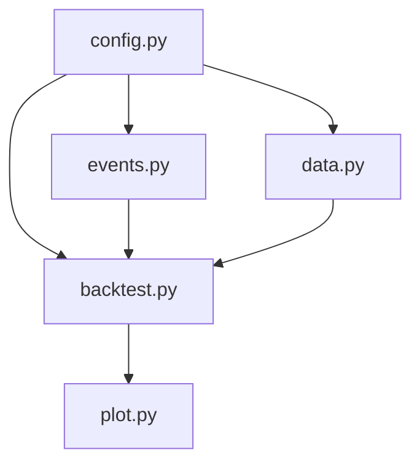

# Core 模块

QKA系统的核心功能模块，包含配置管理、事件系统、回测引擎等关键组件。

## 模块列表

### [config.py](config.md)
配置管理系统，支持多种配置源和动态配置更新。

**主要类：**
- `Config` - 主配置管理类
- `ConfigError` - 配置相关异常

**核心功能：**
- 文件配置加载（YAML、JSON、TOML）
- 环境变量配置
- 代码配置
- 配置验证和模板生成

### [events.py](events.md)
事件驱动框架，提供发布-订阅模式的事件处理机制。

**主要类：**
- `Event` - 基础事件类
- `EventBus` - 事件总线
- `MarketDataEvent` - 市场数据事件
- `OrderEvent` - 订单事件
- `TradeEvent` - 交易事件

**核心功能：**
- 事件发布和订阅
- 异步事件处理
- 事件统计和监控
- 内置交易相关事件

### [backtest.py](backtest.md)
回测引擎，提供策略回测的核心逻辑。

**主要功能：**
- 历史数据回测
- 策略执行模拟
- 性能指标计算
- 结果分析和报告

### [data.py](data.md)
数据处理模块，负责市场数据的获取和处理。

**主要功能：**
- 数据源接入
- 数据清洗和预处理
- 数据缓存和存储
- 数据格式转换

### [plot.py](plot.md)
绘图工具模块，提供回测结果和数据的可视化功能。

**主要功能：**
- 回测结果可视化
- 技术指标图表
- 交易信号展示
- 性能分析图表

## 使用示例

```python
from qka.core import Config, EventBus
from qka.core.events import MarketDataEvent

# 初始化配置
config = Config()
config.load_from_file('config.yaml')

# 创建事件总线
bus = EventBus()

# 注册事件处理器
@bus.subscribe('market_data')
def handle_market_data(event):
    print(f"收到市场数据: {event.data}")

# 发布事件
event = MarketDataEvent(symbol='AAPL', price=150.0, volume=1000)
bus.publish(event)
```

## 模块依赖关系



Core模块是整个QKA系统的基础，其他模块都依赖于这些核心组件。
