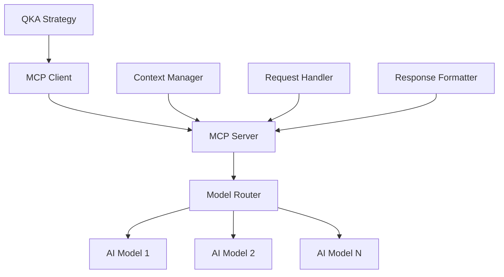

# MCP 模块

QKA系统的Model Context Protocol模块，提供与AI模型的标准化接口。

## 模块列表

### [api.py](api.md)
MCP API定义，提供标准的模型上下文协议接口。

**主要类：**
- `MCPServer` - MCP服务器
- `MCPClient` - MCP客户端
- `ContextManager` - 上下文管理器

**核心功能：**
- 模型接口标准化
- 上下文管理
- 会话管理
- 数据交换

### [server.py](server.md)
MCP服务器实现，处理模型请求和响应。

**主要类：**
- `ModelServer` - 模型服务器
- `RequestHandler` - 请求处理器
- `ResponseFormatter` - 响应格式化器

**核心功能：**
- 请求路由
- 模型调用
- 结果处理
- 错误处理

## 使用示例

```python
from qka.mcp import MCPServer, MCPClient

# 启动MCP服务器
server = MCPServer(port=8080)
server.start()

# 创建MCP客户端
client = MCPClient(server_url='http://localhost:8080')

# 发送模型请求
response = client.request({
    'model': 'strategy_advisor',
    'context': {
        'portfolio': portfolio_data,
        'market_data': market_data
    },
    'query': '分析当前投资组合风险'
})

print(response['advice'])
```

## MCP协议特性

- **标准化接口** - 统一的模型调用方式
- **上下文感知** - 智能的上下文管理
- **异步处理** - 支持异步模型调用
- **可扩展性** - 易于添加新的模型

## 架构图



MCP模块为QKA系统提供了与AI模型交互的标准化方式，支持策略智能化和决策辅助。
