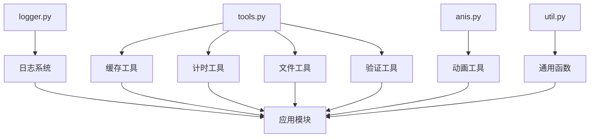

# Utils 模块

QKA系统的工具类模块，提供日志、缓存、计时、格式化等通用功能。

## 模块列表

### [logger.py](logger.md)
增强日志系统，支持彩色输出、结构化日志、文件轮转等功能。

**主要类：**
- `Logger` - 增强日志记录器
- `ColorFormatter` - 彩色日志格式化器
- `StructuredLogger` - 结构化日志记录器

**核心功能：**
- 彩色控制台输出
- 结构化日志记录
- 文件轮转和压缩
- 微信通知集成
- 性能监控日志

### [tools.py](tools.md)
通用工具类，包含缓存、计时器、装饰器等实用功能。

**主要功能：**
- `@cache` - 函数结果缓存
- `@timeit` - 函数执行计时
- `@retry` - 函数重试机制
- `FileHelper` - 文件操作工具
- `FormatHelper` - 格式化工具
- `ValidationHelper` - 数据验证工具

### [anis.py](anis.md)
动画显示工具，提供进度条和动画效果。

**主要功能：**
- 进度条显示
- 动画效果
- 状态指示器

### [util.py](util.md)
通用辅助函数集合。

**主要功能：**
- 数据处理函数
- 字符串操作
- 数学计算工具

## 使用示例

```python
from qka.utils import Logger, cache, timeit, FileHelper

# 日志记录
logger = Logger()
logger.info("系统启动", extra={'module': 'main'})

# 缓存装饰器
@cache(ttl=300)
def get_market_data(symbol):
    # 模拟耗时操作
    return fetch_data(symbol)

# 计时装饰器
@timeit
def expensive_calculation():
    # 耗时计算
    pass

# 文件操作
helper = FileHelper()
helper.ensure_dir('logs')
helper.safe_write('config.json', data)
```

## 工具类关系图



Utils模块为整个QKA系统提供基础工具支持，提高开发效率和代码质量。
