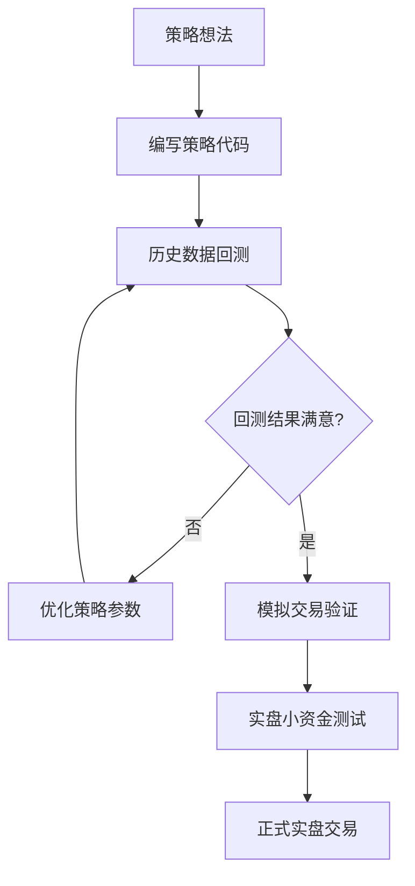
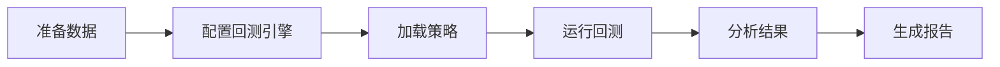
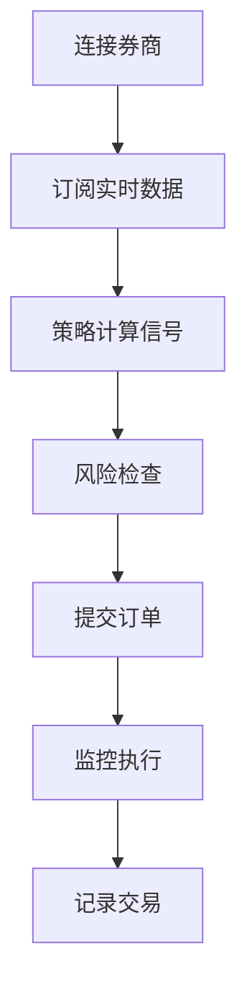

# 基础概念

在开始使用 QKA 之前，了解一些基础概念将帮助您更好地理解和使用这个框架。

## 核心概念

### 策略 (Strategy)

策略是量化交易的核心，定义了买卖股票的逻辑规则。

```python
from qka.core.backtest import Strategy

class MyStrategy(Strategy):
    def on_data(self, data):
        # 在这里实现您的交易逻辑
        pass
```

**关键特点**:
- 策略继承自 `Strategy` 基类
- 通过重写回调方法实现交易逻辑
- 支持参数化配置

### 回测引擎 (Backtest Engine)

回测引擎模拟历史交易环境，验证策略的有效性。

```python
from qka.core.backtest import BacktestEngine

engine = BacktestEngine(
    initial_cash=1000000,     # 初始资金
    start_date='2023-01-01',  # 开始日期
    end_date='2023-12-31',    # 结束日期
    commission_rate=0.0003    # 手续费率
)
```

**主要功能**:
- 模拟真实的交易环境
- 计算手续费和滑点
- 生成详细的交易记录
- 计算各种性能指标

### 数据源 (Data Source)

数据源提供股票的历史和实时价格数据。

```python
from qka.core.data import get_stock_data

# 获取股票数据
data = get_stock_data('000001.SZ', start='2023-01-01', end='2023-12-31')
```

**支持的数据源**:
- **AkShare**: 免费的A股数据接口
- **Tushare**: 专业的金融数据接口
- **QMT**: 迅投QMT交易软件数据
- **Wind**: 万得金融数据库

### 交易客户端 (Trading Client)

交易客户端连接券商接口，执行实际的买卖操作。

```python
from qka.brokers import QMTClient

client = TradingClient()
client.connect()  # 连接券商

# 下单买入
order = client.place_order(
    symbol='000001.SZ',
    side='BUY',
    volume=100,
    price=15.50
)
```

## 数据结构

### 股票代码格式

QKA 使用标准的股票代码格式：

| 交易所 | 代码格式 | 示例 | 说明 |
|--------|----------|------|------|
| 深交所 | XXXXXX.SZ | 000001.SZ | 平安银行 |
| 上交所 | XXXXXX.SH | 600000.SH | 浦发银行 |
| 科创板 | 688XXX.SH | 688001.SH | 华兴源创 |
| 创业板 | 300XXX.SZ | 300001.SZ | 特锐德 |

### 价格数据格式

标准的 OHLCV 格式：

```python
# 数据示例
{
    'open': 15.20,     # 开盘价
    'high': 15.80,     # 最高价
    'low': 15.10,      # 最低价
    'close': 15.50,    # 收盘价
    'volume': 1000000, # 成交量
    'amount': 15500000 # 成交额
}
```

### 订单状态

| 状态 | 说明 |
|------|------|
| `PENDING` | 待提交 |
| `SUBMITTED` | 已提交 |
| `FILLED` | 已成交 |
| `PARTIAL_FILLED` | 部分成交 |
| `CANCELLED` | 已撤销 |
| `REJECTED` | 已拒绝 |

## 交易流程

### 1. 策略开发流程



### 2. 回测流程



### 3. 实盘交易流程



## 性能指标

### 收益率指标

- **总收益率**: 投资期间的总收益百分比
- **年化收益率**: 年化后的收益率
- **基准收益率**: 相对于基准指数的收益率

```python
total_return = (final_value - initial_value) / initial_value
annual_return = (1 + total_return) ** (365 / trading_days) - 1
```

### 风险指标

- **波动率**: 收益率的标准差，衡量收益的不确定性
- **最大回撤**: 从峰值到谷值的最大跌幅
- **VaR**: 在一定置信水平下的潜在损失

```python
volatility = returns.std() * np.sqrt(252)  # 年化波动率
max_drawdown = (peak_value - valley_value) / peak_value
```

### 风险调整收益指标

- **夏普比率**: 超额收益与波动率的比值
- **索提诺比率**: 超额收益与下行风险的比值
- **卡尔马比率**: 年化收益率与最大回撤的比值

```python
sharpe_ratio = (annual_return - risk_free_rate) / volatility
sortino_ratio = (annual_return - risk_free_rate) / downside_deviation
calmar_ratio = annual_return / max_drawdown
```

## 风险管理

### 仓位管理

控制单个股票和总体的仓位大小：

```python
# 单股最大仓位不超过10%
max_position_ratio = 0.1
position_value = volume * price
max_volume = (total_value * max_position_ratio) / price

# 总仓位不超过90%
total_position_ratio = total_position_value / total_value
if total_position_ratio > 0.9:
    # 减仓操作
    pass
```

### 止损止盈

设置合理的止损止盈点：

```python
def check_stop_loss_take_profit(position, current_price):
    cost_price = position.avg_price
    return_rate = (current_price - cost_price) / cost_price
    
    # 止损：亏损超过5%
    if return_rate <= -0.05:
        return 'STOP_LOSS'
    
    # 止盈：盈利超过15%
    elif return_rate >= 0.15:
        return 'TAKE_PROFIT'
    
    return 'HOLD'
```

### 风险分散

- **行业分散**: 不要集中投资单一行业
- **时间分散**: 分批建仓，避免一次性投入
- **策略分散**: 使用多种不同类型的策略

## 常用交易策略类型

### 趋势跟踪策略

基于价格趋势进行交易：

- **移动平均线策略**: 基于不同周期均线的交叉
- **突破策略**: 基于价格突破重要阻力或支撑
- **动量策略**: 基于价格动量指标

### 均值回归策略

基于价格会回归均值的假设：

- **布林带策略**: 价格触及上下轨时交易
- **RSI策略**: 基于相对强弱指标的超买超卖
- **配对交易**: 利用相关股票的价格差异

### 套利策略

利用价格差异获得无风险收益：

- **统计套利**: 基于统计关系的套利
- **事件驱动**: 基于公司事件的套利
- **跨市场套利**: 利用不同市场的价差

## 开发工具和环境

### 推荐开发环境

- **IDE**: VS Code、PyCharm、Jupyter Notebook
- **Python版本**: 3.8 或更高
- **依赖管理**: uv、pip、conda

### 版本控制

```bash
# 初始化Git仓库
git init
git add .
git commit -m "初始化量化策略项目"

# 创建分支
git checkout -b feature/new-strategy
```

### 项目结构

推荐的项目目录结构：

```
my_quant_project/
├── strategies/          # 策略代码
│   ├── __init__.py
│   ├── ma_strategy.py
│   └── bollinger_strategy.py
├── data/               # 数据文件
│   ├── stocks/
│   └── index/
├── backtest/           # 回测结果
│   ├── reports/
│   └── logs/
├── config/             # 配置文件
│   ├── development.json
│   └── production.json
├── tests/              # 测试代码
│   └── test_strategies.py
├── requirements.txt    # 依赖列表
└── README.md          # 项目说明
```

## 学习路径

### 新手入门

1. **理解基本概念** ← 您在这里
2. **完成第一个策略** → [第一个策略](first-strategy.md)
3. **学习数据获取** → [数据获取](../user-guide/data.md)
4. **掌握回测分析** → [回测分析](../user-guide/backtest.md)

### 进阶学习

5. **策略优化技巧** → [策略开发](../user-guide/strategy.md)
6. **风险管理实践** → [风险管理](../examples/risk-management.md)
7. **实盘交易部署** → [实盘交易](../user-guide/trading.md)

### 高级应用

8. **多因子策略** → [多因子策略](../examples/multi-factor.md)
9. **机器学习集成** → [高级示例](../examples/indicators.md)
10. **系统架构设计** → [架构设计](../development/architecture.md)

## 常见术语

| 术语 | 英文 | 说明 |
|------|------|------|
| 多头 | Long | 买入并持有股票的仓位 |
| 空头 | Short | 卖出股票的仓位（A股不支持做空） |
| 开仓 | Open Position | 建立新的交易仓位 |
| 平仓 | Close Position | 了结现有的交易仓位 |
| 滑点 | Slippage | 实际成交价与预期价格的差异 |
| 回撤 | Drawdown | 从峰值到谷值的损失 |
| 基准 | Benchmark | 用于比较策略表现的指数 |
| 因子 | Factor | 影响股票收益的特征变量 |
| 阿尔法 | Alpha | 策略相对于基准的超额收益 |
| 贝塔 | Beta | 策略相对于市场的敏感度 |

现在您已经了解了 QKA 的基础概念，可以开始 [创建您的第一个策略](first-strategy.md) 了！
