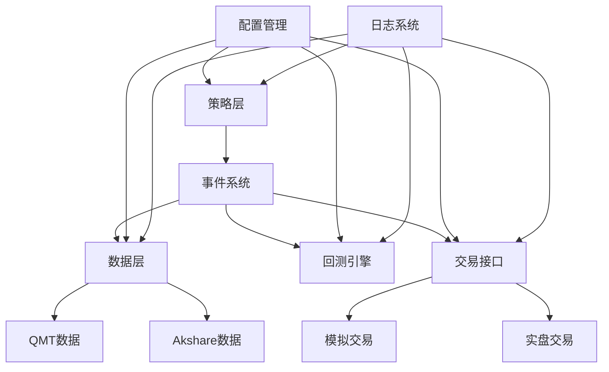

# QKA - 快量化

<div align="center">


**快捷量化助手（Quick Quantitative Assistant）**

一个简洁易用、可实操A股的量化交易框架

[](https://badge.fury.io/py/qka)
[](https://www.python.org/downloads/)
[](LICENSE)

[快速开始](getting-started/installation.md){ .md-button .md-button--primary }
[GitHub](https://github.com/your-username/qka){ .md-button }

</div>

---

## ✨ 特性

!!! tip "核心特性"

    - 🚀 **极简API** - 3行代码完成回测
    - 📊 **多数据源** - 支持QMT、Akshare等数据源
    - 🔄 **事件驱动** - 现代化的事件系统架构
    - 📈 **实盘对接** - 直接对接QMT进行A股实盘交易
    - 🛠️ **工具丰富** - 内置缓存、日志、配置管理等工具
    - 📖 **文档完善** - 详细的文档和示例

## 🚀 快速体验

### 安装

```bash
pip install qka
```

### 3分钟上手

=== "获取数据"

    ```python
    import qka
    
    # 获取股票数据
    data_obj = qka.data('akshare', stocks=['000001', '000002'])
    hist_data = data_obj.get(start_time='2023-01-01', end_time='2023-12-31')
    ```

=== "定义策略"

    ```python
    from qka.core.backtest import Strategy
    
    class MyStrategy(Strategy):
        def on_bar(self, data, broker, current_date):
            for symbol, df in data.items():
                if len(df) >= 20:
                    price = df['close'].iloc[-1]
                    ma20 = df['close'].rolling(20).mean().iloc[-1]
                    
                    if price > ma20 and broker.get_position(symbol) == 0:
                        broker.buy(symbol, 0.3, price)  # 买入30%资金
                    elif price < ma20 and broker.get_position(symbol) > 0:
                        broker.sell(symbol, 1.0, price)  # 全部卖出
    ```

=== "运行回测"

    ```python
    # 运行回测
    result = qka.backtest(
        data=data_obj,
        strategy=MyStrategy(),
        start_time='2023-01-01',
        end_time='2023-12-31'
    )
    
    # 查看结果
    print(f"总收益率: {result['total_return']:.2%}")
    print(f"年化收益率: {result['annual_return']:.2%}")
    print(f"最大回撤: {result['max_drawdown']:.2%}")
    ```

## 📋 功能模块

<div class="grid cards" markdown>

-   :material-database:{ .lg .middle } __数据管理__

    ---

    支持多种数据源，自动缓存，数据质量检查

    [:octicons-arrow-right-24: 了解更多](user-guide/data.md)

-   :material-brain:{ .lg .middle } __策略开发__

    ---

    简洁的策略框架，丰富的技术指标，事件驱动

    [:octicons-arrow-right-24: 了解更多](user-guide/strategy.md)

-   :material-chart-line:{ .lg .middle } __回测分析__

    ---

    高效的回测引擎，详细的绩效分析，可视化图表

    [:octicons-arrow-right-24: 了解更多](user-guide/backtest.md)

-   :material-rocket-launch:{ .lg .middle } __实盘交易__

    ---

    直接对接QMT，支持A股实盘交易，风险控制

    [:octicons-arrow-right-24: 了解更多](user-guide/trading.md)

</div>

## 🏗️ 架构优势



## 📊 使用场景

!!! example "典型应用"

    - **量化策略研究** - 快速验证交易想法
    - **A股程序化交易** - 实盘自动化交易
    - **金融数据分析** - 多源数据整合分析
    - **风险管理** - 投资组合监控和风控
    - **教学研究** - 量化金融教学和研究

## 🎯 版本规划

| 版本 | 状态 | 主要功能 |
|------|------|----------|
| v0.1.x | ✅ 已发布 | 基础回测、数据接口、QMT交易 |
| v0.2.x | 🚧 开发中 | 配置管理、事件系统、增强日志 |
| v0.3.x | 📋 规划中 | 数据缓存、质量检查、多频率 |
| v0.4.x | 📋 规划中 | 策略优化、风险管理、指标库 |
| v1.0.x | 📋 规划中 | 稳定版本、完整文档、生态 |

## 🤝 社区

- 💬 **讨论交流** - [GitHub Discussions](https://github.com/your-username/qka/discussions)
- 🐛 **问题反馈** - [GitHub Issues](https://github.com/your-username/qka/issues)
- 📧 **联系邮箱** - mayuanchi1029@gmail.com

---

<div align="center">

**开始您的量化之旅** 🚀

[立即开始](getting-started/installation.md){ .md-button .md-button--primary }

</div>
